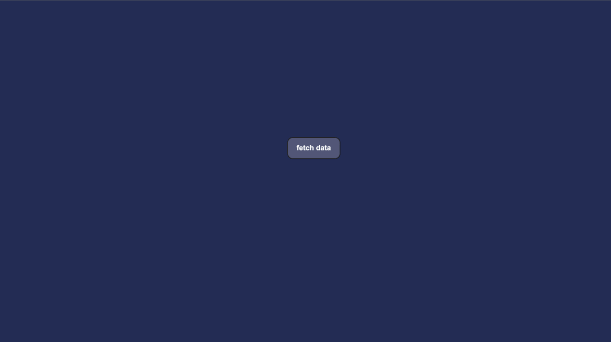

# weather-application
A simple `weather-application` capable of fetching and visualising 5 days weather forecast data with 3-hour step.

 </img>

## Tech stack

- [Typescript](https://www.typescriptlang.org/)
- [React](https://reactjs.org/)
- [Redux Toolkit](https://redux-toolkit.js.org/)
- [Webpack](https://webpack.js.org/)
- [Docker](https://www.docker.com/)
- [Nginx](https://www.nginx.com/)
- [Axios](https://github.com/axios/axios)
- [lint-staged](https://github.com/okonet/lint-staged/)
- [Prettier](https://prettier.io/)
- [Eslint](https://eslint.org/)
- [Jest](https://jestjs.io/)
- [Open Weather Map API](https://openweathermap.org/forecast5)

## How to run application

Verify if you use Node.js 6.x or higher (Node.js ^10 is recommended) and Docker before start.

1. Clone the stable branch

```
git clone -b git@github.com:vadimfrolov/weather-application.git
cd weather-application
```

2. Create .env file in root folder with your key

```typescript
APP_ID='your app key'
```


3. Run Docker

```
docker-compose up --build
```

4. Check the website in your browser

```
http://localhost:3000/
```

5. To stop docker containers

```
docker-compose stop
```

## How to run tests

Verify if you use Node.js 6.x or higher (Node.js ^10 is recommended).

1. Install npm packages

```
npm i
```

2. Run tests

```
npm run test
```


## Project structure
```bash
weather-application

├── .husky                      # pre-commit config
├── node_modules                # Global Node.js modules
├── src                    	# Available packages
│   ├── assets                  # images, fonts and styles
│   ├── axios                   # axios config
│   ├── components              # app components
│   ├── nginx                  	# nginx config and Dockerfile
│   ├── pages                  	# app pages
│   ├── services                # services for data fetch
│   ├── utils                  	# utils
│   └── store                   # redux store
├── webpack                     # webpack settings
├── tsconfig.json               # Typescript settings

```

## Road map
- [ ] add more tests
- [ ] add aliases for roots
- [ ] add city input
- [ ] create demo on Heroku
- [ ] create Gitlab CI/CD pipeline to Github actions and dockerhub registry.
- [ ] use Teleport API for city names fetching

